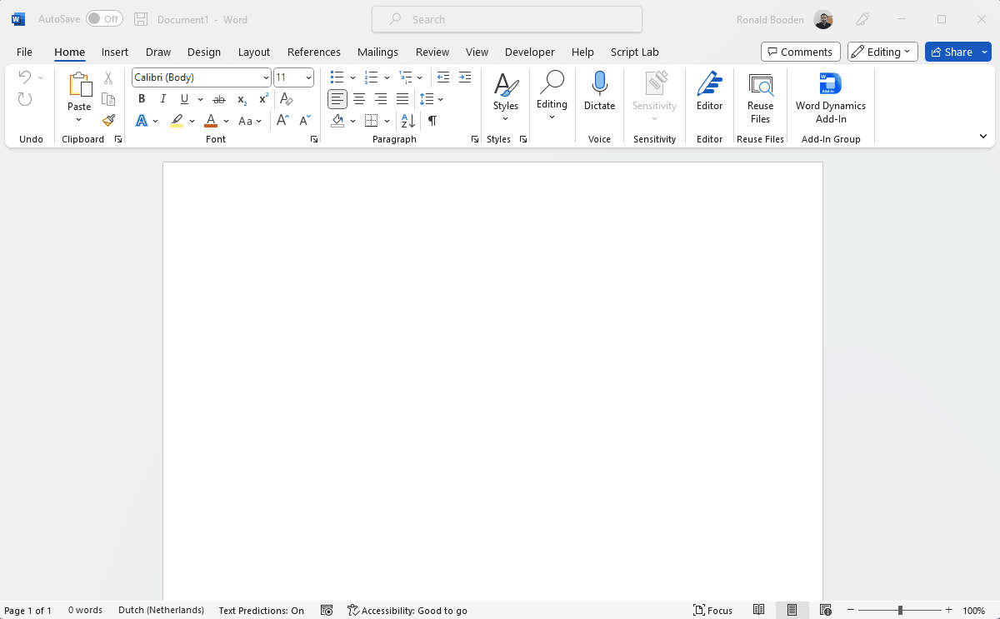
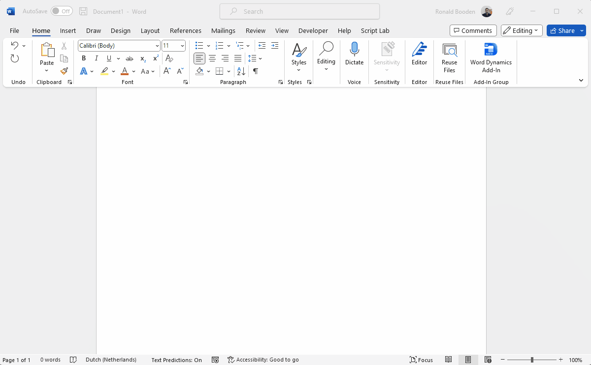

# Word Dynamics Add-In  

This repository contains the client side **word-dynamics-addin** and the server side **word-dynamics-api** parts for the Word Dynamics Add-In. This can be opened and edited using VS Code (use Run as administrator to enable `npm start`), to work with either project, change the directory (`cd`) within the terminal window.

Before using, please take a look at [Use Word templates to create standardized documents](https://learn.microsoft.com/en-us/power-platform/admin/using-word-templates-dynamics-365) to see if the out of the box functionality resolves your needs. This add-in provides a different way of using data from Dynamics in a Word template. It could be useful if users create a document from a template within SharePoint for example, and if you require more ad-hoc and/or require data from multiple unrelated entities in one document, this add-in can fill that need.

[[_TOC_]]

## App registration
Create separate app registrations for development and for production. For instructions, please see: [Register an Office Add-in that uses single sign-on (SSO) with the Microsoft identity platform](https://learn.microsoft.com/en-us/office/dev/add-ins/develop/register-sso-add-in-aad-v2)

For **Add Microsoft Graph permissions** the following Delegated graph permission are required:
- profile 
- openid
- Files.ReadWrite
- User.Read

And Delegated permissions for Dynamics CRM:

- user_impersonation

Grant admin consent for your tenant

Store your secrets in a secure location. Then configure the two projects.

It is also posible to use the **CreateAppRegistration.ps1** PowerShell commands for creating the app registration *(uses Azure CLI)*. This PowerShell script can even do the configuration for you.

### word-dynamics-addin
Update the client id in the **manifest.xml** within **WebApplicationInfo** the **Id** and the id part of **Resource**, this should be the development id. In the **webpack.config.js** set **devClientId** (development) and **clientId** (production), also update the production url **urlProd** with the url to be used in production. This will ensure that the correct value will be set when building and updating the front-end project:

`npm run update-addin`

### word-dynamics-api
Update the settings in the **appsettings.json** and create a **appsettings.Development.json** file (just use a copy) then set the development client id/audience and secret. Perhaps only add the secret to the development copy, as this file has been added to .gitignore

> **Be careful, don't check in any secrets in source control**

## Local development and testing
For the server side code you can start debugging from VS Code, or `cd` into the api folder and use `dotnet run` to start the api without debugging (also available trough ctrl+F5). For starting the front-end use the terminal (remember to `cd` into the addin folder) `npm run update-addin:dev` this will build and update the front-end using the development settings. Then start with `npm start` (requires VS code started with Run as administrator)

You might need to add a developer certificate for the api project:

`dotnet dev-certs https`

## Configuration
You will need to configure the available entities and properties in the **settings.json** file located in the root of the **word-dynamics-addin** folder. This section will describe the contents of the configuration. The root of the config json file is an array of **Entity**, properties are required by default unless (optional) is mentioned.

Besides this, optionally you can add additional locales files if needed, currently Dutch (*nl-nl.json*) and English (*en-us.json*) are supplied. These files need to be placed in the **wwwroot\locales** folder. The translation will be loaded for the language used for Office (**File > Options > Language**). If not found it will use the default language (*en-us*), if translations are missing the default (*hard coded*) translation will also be used.

See configuring the entities, take a look at (while already logged in in the browser on Dynamics) **https://[yourdynamics].crm4.dynamics.com/api/data/v9.2/** to retrieve the entities, then use **https://[yourdynamics].crm4.dynamics.com/api/data/v9.2/[entityname]?$top=1** to retrieve the first instance of that entity, so you know what properties are available.

Only use entities and properties that are available for the users that use the add-in, as these users will only be allowed to access entities and properties they have access to.

Below you will find the description of the settings:

### Entity

| Property | Type | Description |
|----------|------|-------------|
| uniqueName | string | The unique identifying name of the entity |
| displayName | string | The display name of the entity show in the entity selection dropdown |
| tableName | string | The name of the table in the [Dataverse API](https://learn.microsoft.com/en-us/power-apps/developer/data-platform/webapi/overview) (these are pluralized) |
| isHidden | boolean (optional) | Indicates if the entity should be hidden in the entity picker. This can be used for include entities that use different settings or should not be available separately |
| labelField | string | The field name to be used for the value that is displayed for each found item (use , separated field names to join multiple field values separated by a space, for example: firstname,lastname) |
| fields | EntityField[] | Array of fields that are available for selection, see EntityField |
| searchField | string | The field that will be search on, should be a text field in Dynamics |
| additionalFilter | string (optional) | This can contain an additional odata filter expression that is used for this entity |
| autoSearchEnabled | boolean (optional) | If set to true, search will happen on selection of the entity, don't use this for large result, could be used with additionalFilter or the topLimit option to limit the results |
| iconName | string | The name of the icon to be shown for each entity item, uses [Fluent UI icons](https://developer.microsoft.com/en-us/fluentui#/styles/web/icons) |
| includeEntity | IncludeEntity[] (optional) | Array of included entities that are available for selection, see IncludeEntity |
| topLimit | number (optional) | If specified and > 0 this will be set as the top limit of items to retrieve for the search query |
| orderBy | string (optional) | If specified the sort order of the query for the entity. This can be multiple fields including asc and desc, for example **name desc, createdon desc** If not specified the sort order will be ascending for the labelField property |

### EntityField

| Property | Type | Description |
|----------|------|-------------|
| displayName | string | The display name of the property as shown in the property picker and used in the title of the ContentControl in Word |
| fieldName | string | The field name of the property of the entity (use , separated field names to join multiple field values separated by a space, for example: firstname,lastname) |
| customFieldName | string (optional) | This can be set to a custom field name, so existing content controls can be targetted, an also you are able to use this from multiple entities, so it can override fields, as by default the entity unique name will be included |
| containsHtml | boolean (optional) | Set true if the field contains html content |

### IncludeEntity
This entity should have a *(include entity)* 1-N *(source entity)*  or a 1-1 relation, allthough having an include entity is not mandatory so 0 is supported, the ContentControls will get a empty *(space)* value. If there is a N-[1|N] relation then only top 1 result is retrieved.

| Property | Type | Description |
|----------|------|-------------|
| uniqueName | string | The unique name of the entity as available in the settings, this could be the name of a hidden entity |
| sourceField | string | The field name that contains the lookup value contained in the current entity, will be automatically included, typically these fields have the following markup **_[fieldname]_value** or contains the id field of the entity (example: _parentcustomerid_value eq '[accountid]') |
| targetField | string | The field name as used in the target entity for the lookup, typically this will be the identity field or would have the following markup **_[fieldname]_value** |

## Deployment
For deployment first do a release build of the front-end code, first `cd` into the addin folder, then:

`npm run update-addin`

Then on the dotnet side, `cd` into the api folder, then:

`dotnet publish --configuration Release`

Then copy the files contained in the **..\word-dynamics-api\bin\Release\net7.0\publish\\** path that is displayed in the wwwroot folder of your web application, and update the appsettings.json and manifest.xml if needed.

To make the add-in available for office, please read: [Recommended approach for deploying Office Add-ins and Deploy an Office Add-in using the admin center](https://learn.microsoft.com/en-us/microsoft-365/admin/manage/test-and-deploy-microsoft-365-apps?view=o365-worldwide#recommended-approach-for-deploying-office-add-ins)

Instead of 'Get apps' use 'Upload custom apps' with type 'Office add-in' and 'provide link' pointing to **https://[yoururl]/manifest.xml** and click validate, then follow the instructions.

## Usage

### Enable add-in in Word
Add the add-in using the **Insert** tab, and the **Add-ins** section, use the **My Add-ins** button. In the dialog select the **ADMIN MANAGED** tab, click **Refresh** if the add-in is not yet visible, select the **Word Dynamics Add-In** and click the **Add** button. The Add-In will then be available in the **Start** tab.

### Add-In usage
Basic working: In the drop down dialog you can select an entity. You can click the icon next to the entity selection dialog for selecting search, edit and snippet. 

Create a template using editing mode, this will add ContentControl placeholders to the Word document. In edit mode you can click on the properties of the entity to add these to the current cursor location.

Click the icon to select search for navigating back to searching. Type a search text in the search box and press Enter to search withing the selected entity. Click one of the found items you want to update the ContentControls with to update the contents.

For creating snippets select the snippet icon, select the content you want to create a snippet for, type a unique name and press the button behind the name to save the snippet. Click the snippet to add it at the cursor location/selection in the Word document.

#### Entities that include other entities
Entity columns of included entities, if available, are shown in edit mode with the entity name and indented field names. When selecting these properties, these will be filled in automatically while selecting an item from the original entity. For example, if a contact has included account fields, the account fields associated with the contact will be filled in while selecting the contact to be added. These properties will not be filled in (by default) while directly selecting an Account.

Editing and usage animation:

Creating and using snippets animation:

### Advanced scenarios
In advanced scenarios a **customFieldName** can be added to a field, this will allow reusing a field from multiple entities, also it provides an option to work with existing ContentControls.

## License
All files in this GitHub repository are subject to the [MIT license](./LICENSE).